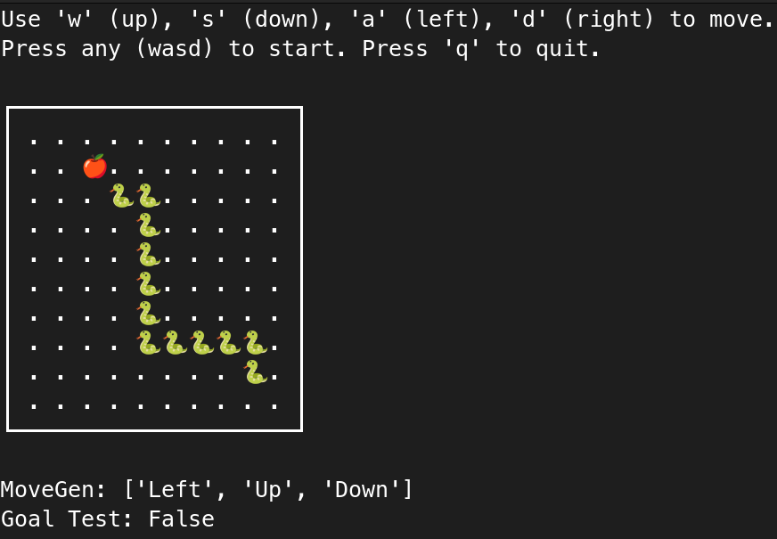

# 🐍 SnakeGame 🐍

Plaksha University Semester V (Monsoon 2024)  
AI3022 Search Methods in AI - Professor Deepak Khemani  
Assignment 1  
Done By - [Malhar Bhise](https://github.com/coolperson111) and [Utkarsh Agarwal](https://github.com/Utk984)  



## Problem Statement

### Part 1

Choose a new problem that can be posed as a state space search problem.

    Design a domain representation for the state to facilitate defining the following:

    Devise a MoveGen or a neighbourhood function to take a given state as an argument and return the set of neighbouring states. Eliminate states that do not respect the domain constraints. For example, the lion should not be left alone with the goat in the MGLC problem.

    Devise a GoalTest function that accepts a state as input and returns true if the state is a goal state, and false otherwise.

Think about how a user can be allowed to specify the start state. For example, a state in an instance of a water jug problem with the jug sizes and contents being user-defined. Also, how can a user specify the goal state. For example, how much water is to be measured.

Submit a short description of your problem and the representation scheme.

Credit will be assigned for choosing a new and interesting domain. Do not choose examples used in the class or commonly found in textbooks.

The assignment has to be done in groups of 2. Only 1 member from each group needs to submit the assignment.


### Part 2

For your chosen problem in part 1

    implement the Depth First Search Algorithm
    implement the Breadth First Search Algorithm
    define a heuristic function and implement the Best First Search Algorithm

Submit your code by the due date (no extensions). Along with the code, submit a small report describing your implementation and also performance of the three programs on the same problem, or a set of problems. Program demonstrations may be scheduled in due course


## Run Game

In order to play the game, follow the following steps:

```bash
# Clone the repo and change directory
git clone https://github.com/Utk984/SnakeGame.git
cd SnakeGame

# install requirements
pip install -r requirements.txt

# Run the game
./run.sh

# OR with specifying command line arguments
# last arg - 1 for DFS, 2 for BFS, anything else for user control
# eg - board 5x5, snake pos (2, 3), and 0 for user control
./run.sh 5 5 2 3 0
```


## Snake constraints

These are constraints we implemented into the snake when we built them, for the knowledge of the user/player. These are intended to be the way. They are *conscious* decisions made by the developers of this game.

- Head moves before rest of body, so if you try to move head where previous tail was, you will die.
- Even a 1 length snake cannot go back on itself (i.e turn 180 degrees)


## ISSUES Tracker

- [ ] Print Snake head and body differently?

- [x] Maybe change the last command line arg to accept "user"/"bfs"/"dfs"/"bestfs" instead of 0/1/2/3/4 as that would be more intuitive
- [x] Output time at the end of the game in a more understandable manner
- [x] When user is playing, and goal test is reached, the game shows goal test not reached
- [x] User args to define snake pos and game pos
- [x] If you go back into the snake, the snake dies
- [x] If you go off the board, the snake pops from other side (can change that)
- [x] No MoveGen or goaltest functions
- [x] No documentation of our work
